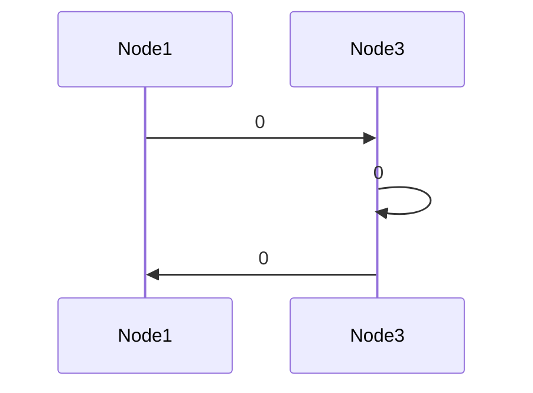

# Caravel

> ⚠️**Warning!**  
> 
> `Caravel` is a pre‑release framework.
The public API, documentation and internal implementation are still evolving, and breaking changes may occur in future releases.

`Caravel` is a framework that provides an abstraction for creating and navigating graphs. Enabling developers to define relationships between nodes and traverse them efficiently using Dijkstra's algorithm for shortest path calculations.

**Table of Contents:**

- [Caravel](#caravel)
  - [Getting Started](#getting-started)
    - [Creating Nodes and Journeys](#creating-nodes-and-journeys)
      - [Defining Nodes](#defining-nodes)
      - [Creating a Journey](#creating-a-journey)
  - [Example Usage](#example-usage)
  - [Key Features](#key-features)
    - [Graph Navigation with Dijkstra Algorithm](#graph-navigation-with-dijkstra-algorithm)
    - [Step-by-Step Node Navigation](#step-by-step-node-navigation)
    - [Waypoints \& Exclusion Rules](#waypoints--exclusion-rules)
    - [Node Lifecycle Events](#node-lifecycle-events)
    - [Contextual Actions in Nodes](#contextual-actions-in-nodes)
    - [Cancellation \& Timeout Management](#cancellation--timeout-management)
    - [Documentation via Mermaid](#documentation-via-mermaid)
    - [UI Automation Ready](#ui-automation-ready)
  - [Tips](#tips)


## Getting Started

1. Define your nodes implementing INode.
1. Create a graph using DijkstraGraph.
1. Initialize a journey with a starting node.
1. Navigate using fluent methods like .GotoAsync<T>() or .DoAsync<T>().
1. Optionally document your journey and graph using Mermaid tools.

[[↑ top](#caravel)]

### Creating Nodes and Journeys

#### Defining Nodes

Each node must implement the `INode` interface:

```csharp
using System.Collections.Immutable;
using Caravel.Abstractions;
using Caravel.Core.Extensions;

internal sealed class Node1 : INode
{
    public ImmutableHashSet<IEdge> GetEdges()
    {
		// Extension method 'CreateEdge' is a helper
		// to create a new 'Edge'.
        return [
            this.CreateEdge(OpenNode2),
            this.CreateEdge(OpenNode3)
        ];
    }

    private static Task<Node2> OpenNode2(IJourney journey, CancellationToken cancellationToken) =>
        Task.FromResult(new Node2());

    private static Task<Node3> OpenNode3(IJourney journey, CancellationToken cancellationToken) =>
        Task.FromResult(new Node3());

    public Task OnNodeVisitedAsync(IJourney journey, CancellationToken cancellationToken)
    {
        // Add your own logic
        return Task.CompletedTask;
    }
}
```

[[↑ top](#caravel)]

#### Creating a Journey

```csharp

	// Create the nodes
	var node1 = new Node1();
	var node2 = new Node2();
	var node3 = new Node3();
	INode[] nodes = [node1, node2, node3];

	// Generate the graph
	var routeFactory = new RouteFactory();
	var edgeFactory = new EdgeFactory();
	var graph = new DijkstraGraph(nodes, routeFactory, edgeFactory);

	// Create the Journey with default configuration
	var journeyConfiguration = JourneyConfigurationFactory.Create(
        JourneyLegHandlingOptions.InMemory,
        TimeProvider.System);

	var journey = new Journey(
        startingNode: node1,
        graph,
        journeyConfiguration,
        CancellationToken.None
    );

```

[[↑ top](#caravel)]

## Example Usage

```csharp
	// Use a journey with Node1 as starting node to goto Node3.
	// Perform some action in the context of Node3
	// then go back to Node1.
	
	await journey
        .GotoAsync<Node3>()
        .DoAsync<Node3>((node3, cancellationToken) =>
        {
            // Perform some action on Node3
            return Task.FromResult(node3);
        })
        .GotoAsync<Node1>();

    var navigationSequence = await journey.ToMermaidSequenceDiagramMarkdownAsync();

```

The navigationSequence will contain the following Mermaid sequence diagram:

```text
sequenceDiagram
Node1->>Node3:0
Node3->>Node3:0
Node3->>Node1:0
```




> **Note:** Copy the above code into a `.md` file and open it in a markdown viewer that supports Mermaid to visualize the diagram or use [Mermaid Live Editor](https://mermaid.live/) to paste the code and see the rendered diagram.

[[↑ top](#caravel)]


## Key Features

### Graph Navigation with Dijkstra Algorithm

`Caravel` supports the creation of weighted and unweighted graphs through `Caravel.Graph.Dijkstra`. Using Dijkstra's algorithm, it can compute the shortest route from any node to another, making it ideal for applications requiring optimal pathfinding.

[[↑ top](#caravel)]

### Step-by-Step Node Navigation

With methods like `GotoAsync<TDestination>`, `Caravel` allows step-by-step navigation through a graph. Each node implements `INode.GetEdges()` to declare its neighbors and transitions, enabling fluent navigation patterns.

[[↑ top](#caravel)]

### Waypoints & Exclusion Rules

Navigation can be controlled using:

* **Waypoints**: Nodes that must be traversed in a specified order.
* **ExcludedWaypoints**: Nodes that should be avoided during pathfinding.

This makes complex routing logic flexible and maintainable.

[[↑ top](#caravel)]

### Node Lifecycle Events

When a node is visited by `Caravel`, `INode.OnNodeVisitedAsync()` is invoked. This allows for:

* Validation (e.g., waiting for prerequisites)
* Logging or monitoring
* Dynamic behavior based on node state (e.g., retrying on failure, set a flag on first visit, etc.)

[[↑ top](#caravel)]

### Contextual Actions in Nodes

`Caravel` supports executing actions within the context of the current node using `DoAsync<TCurrentNode>` or transitioning to another node via `DoAsync<TCurrentNode, TTargetNode>`. This enables rich workflows with side-effects and dynamic navigation.

`GotoDoAsync<TOriginNode, TTargetNode>` can be used to combine navigation and action in a single step. It navigates to `TOriginNode` and performs the specified action returning `TTargnetNode`. `TTargnetNode` can be the same as `TOriginNode` to perform actions without changing nodes.

[[↑ top](#caravel)]

### Cancellation & Timeout Management

Each journey has a global timeout (`JourneyCancellationToken`) that applies across all operations. Scoped cancellation tokens can be passed to individual actions for fine-grained control while still respecting the overall timeout.

### Documentation via Mermaid

`Caravel` integrates seamlessly with Mermaid.js for documentation:

* **Graph Diagrams**: Visualize the entire graph structure.
* **Sequence Diagrams**: Document navigation flows and action sequences.
* Support for metadata, relative nodes positions, and custom descriptions.

[[↑ top](#caravel)]

### UI Automation Ready

`Caravel` is compatible with Page Object Models (POM) and tools like [Playwright](https://playwright.dev/dotnet/), making it suitable for automating UI journeys in web or desktop applications.

[[↑ top](#caravel)]

## Tips

1. Use [global using file](https://learn.microsoft.com/en-us/dotnet/csharp/language-reference/keywords/using-directive#the-global-modifier) with references to `Caravel` namespaces to simplify your code files:  
```csharp
global using Caravel.Abstractions;
global using Caravel.Abstractions.Exceptions;
global using Caravel.Core.Configurations;
global using Caravel.Core.Extensions;
global using Caravel.Mermaid;
global using static Caravel.Mermaid.GraphExtensions;
global using static Caravel.Mermaid.JourneyExtensions;
global using static Caravel.Mermaid.RouteExtensions;
```

[[↑ top](#caravel)]